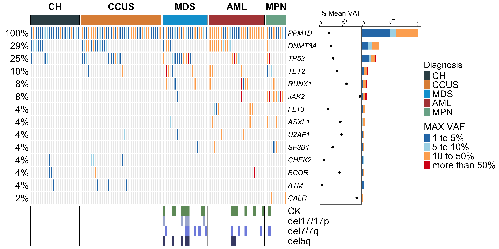

# Code and Data accompanying manuscript _Clonal Evolution of PPM1D Mutations in the Spectrum of Myeloid Disorders_ 



## :open_file_folder: Repository Structure

- **`data/`**: the folder contains the clinical and processed molecular data to reproduce the results and figures of the study.

- **`code/`**: the folder contains R scripts to reproduce figures of the study.

- **`figures/`**: the folder contains the final png versions of the figures and supplementary figures (will be generated by running the scripts).

## :rocket: Get started

To clone this repository on your local computer please run:

```shell
$ git clone https://github.com/ElsaB-Lab/Fandrei_et_al_2025.git
```
## :question: Questions

If any question on the repo, feel free to contact [David](https://github.com/davidfdr99).
